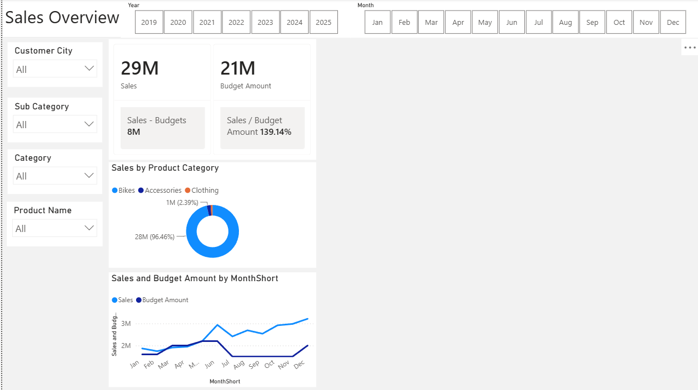

# Sales & Business Analytics

## Overview

This project is a data analytics portfolio project built using SQL Server and Power BI. It uses the AdventureWorksDW2022 data warehouse to analyze internet sales performance, customers, products, sales representatives, and sales trends over time.

The project demonstrates an end-to-end analytics workflow, from working with a SQL Server data warehouse and preparing data for analysis to creating an interactive Power BI dashboard.

## Business Request

The Sales Manager, Steven, requested an improvement to the existing internet sales reporting process by moving from static reports to interactive visual dashboards.

The primary business requirements are to provide a clear overview of:

- How much has been sold
- Which products are selling the most
- Which customers are purchasing the most
- How sales performance has changed over time
- Sales performance by sales representative
- Sales performance compared against the provided budget

The business normally analyzes sales performance by looking approximately two years back in time. A sales budget was provided separately in an Excel spreadsheet to enable comparison between actual sales performance and budgeted performance.

The requested solution is an interactive Power BI dashboard that allows users to explore these areas through visualizations, KPIs, filters, and slicers.

## Business Demands & User Stories

### Business Demand Overview

| Requirement                    | Description                                    |
| ------------------------------ | ---------------------------------------------- |
| **Reporter**                   | Steven – Sales Manager                         |
| **Value of Change**            | Visual dashboards and improved sales reporting |
| **Necessary Systems**          | Power BI, CRM System                           |
| **Other Relevant Information** | Sales budget provided in Excel                 |

### User Stories

#### 1. Sales Manager – Internet Sales Overview

**As a Sales Manager**, I want an overview of internet sales so that I can better understand which customers and products are performing best.

**Acceptance Criteria:**

- Power BI dashboard providing an overview of internet sales
- Dashboard data updates once a day
- Ability to identify top-performing customers and products

#### 2. Sales Representative – Customer Analysis

**As a Sales Representative**, I want a detailed overview of internet sales by customer so that I can identify my highest-value customers and potential opportunities for additional sales.

**Acceptance Criteria:**

- Power BI dashboard provides customer-level sales analysis
- Users can filter the data by individual customer

#### 3. Sales Representative – Product Analysis

**As a Sales Representative**, I want a detailed overview of internet sales by product so that I can identify which products are selling the most.

**Acceptance Criteria:**

- Power BI dashboard provides product-level sales analysis
- Users can filter the data by individual product

#### 4. Sales Manager – Sales vs Budget

**As a Sales Manager**, I want an overview of internet sales over time compared against budget so that I can monitor sales performance against targets.

**Acceptance Criteria:**

- Power BI dashboard provides sales trends over time
- Dashboard includes graphs and KPIs
- Actual sales can be compared against the budget

## Tools & Technologies

- SQL Server
- SQL Server Management Studio (SSMS)
- Power BI
- DAX
- SQL
- AdventureWorksDW2022
- Excel

## Dataset

The project uses Microsoft's AdventureWorksDW2022 sample data warehouse.

The original AdventureWorksDW dataset contains historical data from 2010–2014. The database was updated using a SQL script to shift the dates forward so that the dataset covers more recent years. The script also extends the `DimDate` table and updates associated date keys and date fields across the fact and dimension tables.

The project focuses primarily on the internet sales data and related customer, product, employee/sales representative, and date dimensions required to address the business requirements.

## Setup & Installation

The AdventureWorksDW2022 database backup file is **not included in this repository** because of its large file size.

### 1. Download AdventureWorksDW2022

Download the `AdventureWorksDW2022.bak` backup file from Microsoft's official AdventureWorks documentation:

[AdventureWorks Installation and Configuration](https://learn.microsoft.com/en-us/sql/samples/adventureworks-install-configure)

### 2. Copy the Backup File

After downloading the `AdventureWorksDW2022.bak` file, copy it to your SQL Server backup directory.

For example:

```text
C:\Program Files\Microsoft SQL Server\MSSQL16.SQLEXPRESS\MSSQL\Backup
```

> The exact backup directory may differ depending on your SQL Server installation and instance.

### 3. Restore the Database

Open **SQL Server Management Studio (SSMS)** and connect to your SQL Server instance.

Restore the `AdventureWorksDW2022` database using the downloaded `.bak` file.

The restored database will be used as the primary data source for the SQL analysis and Power BI dashboard.

### 4. Update the Database Dates

The original AdventureWorksDW dataset contains historical data from 2010–2014. A SQL script is included in this repository to shift the database dates forward to more recent years.

The script:

- Calculates the current year.
- Determines the number of years the existing data needs to be shifted.
- Extends the `DimDate` table with additional dates.
- Updates date fields across relevant fact and dimension tables.
- Updates the associated `DateKey` values.
- Updates year-based fields such as `CalendarYear`, `FirstOrderYear`, `LastOrderYear`, and `YearOpened`.
- Temporarily removes relevant foreign key constraints while the date updates are performed.
- Recreates the foreign key constraints after the date updates are complete.

Run the date-update SQL script against the `AdventureWorksDW2022` database in SSMS.

### 5. Verify the Database

After running the update script, verify that:

- `AdventureWorksDW2022` is accessible in SSMS.
- The `DimDate` table contains the newly added dates.
- Fact and dimension tables contain the updated dates.
- Date keys remain consistent with the updated dates.
- Foreign key constraints have been restored successfully.

## Data Preparation

### Fact Table vs Dimension Table

Before preparing the data for analysis, the AdventureWorks data warehouse schema is reviewed to distinguish between fact tables and dimension tables.

**Fact tables** contain measurable business events and numerical values used for analysis, while **dimension tables** provide descriptive attributes used to categorize and filter those facts.

The analysis primarily focuses on the `FactInternetSales` fact table and the related dimensions required to answer the business questions.

### Identify Necessary Tables

The required tables were identified based on the business request and user stories.

The analytical dataset requires data related to:

- Internet sales
- Dates and time periods
- Products
- Customers
- Sales representatives
- Budget data

The following AdventureWorks tables were prepared for the analytical dataset:

- `DimDate`
- `DimCustomer`
- `DimProduct`
- `FactInternetSales`

Additional supporting tables such as geography, product subcategory, and product category were used during transformation to enrich the prepared dimension tables.

## Data Cleansing & Transformation

The data cleansing and transformation stage prepares the source data for analysis and Power BI by selecting only relevant fields, creating useful calculated attributes, renaming columns, joining related dimension information, handling missing values, and limiting the sales dataset to the required analytical period.

### 1. DIM_Calendar Transformation

The original `DimDate` table contains a number of fields that are not required for the current analysis. A SQL query was used to select the relevant calendar attributes and rename several fields for easier use in the analytical model.

The transformation:

- Keeps `DateKey` as the date dimension key.
- Renames `FullDateAlternateKey` to `Date`.
- Uses the English day name as `Day`.
- Renames `WeekNumberOfYear` to `WeekNr`.
- Uses `EnglishMonthName` as `Month`.
- Creates `MonthShort` using the first three characters of the month name.
- Renames `MonthNumberOfYear` to `MonthNo`.
- Renames `CalendarQuarter` to `Quarter`.
- Renames `CalendarYear` to `Year`.
- Excludes unused day, language, semester, and fiscal fields.

The prepared calendar data was exported as:

```text
CSV/DIM_Calendar.csv
```

### 2. DIM_Customers Transformation

The `DimCustomer` table was reduced to the customer attributes required for analysis.

The transformation:

- Keeps `CustomerKey` as the customer identifier.
- Renames `FirstName` to `First Name`.
- Renames `LastName` to `Last Name`.
- Creates a new `Full Name` field by combining first and last names.
- Converts the source gender codes (`M` and `F`) into readable values (`Male` and `Female`).
- Keeps `DateFirstPurchase` for customer purchase analysis.
- Joins `DimGeography` using `GeographyKey` to add the customer's city.
- Renames the resulting city field to `Customer City`.
- Excludes customer attributes that are not required for the current analysis.

The prepared customer data was exported as:

```text
CSV/DIM_Customers.csv
```

### 3. DIM_Products Transformation

The `DimProduct` table was transformed to provide the product information required for product-level sales analysis.

The transformation:

- Keeps `ProductKey` as the product identifier.
- Renames `ProductAlternateKey` to `ProductItemCode`.
- Renames `EnglishProductName` to `Product Name`.
- Joins `DimProductSubcategory` to obtain the product subcategory.
- Joins `DimProductCategory` to obtain the product category.
- Renames these fields to `Sub Category` and `Product Category`.
- Renames `Color` to `Product Color`.
- Renames `Size` to `Product Size`.
- Keeps `ProductLine`.
- Renames `ModelName` to `Product Model Name`.
- Keeps `EnglishDescription` as `Product Description`.
- Uses `ISNULL()` to replace missing product status values with `Outdated`.

The prepared product data was exported as:

```text
CSV/DIM_Products.csv
```

### 4. FACT_InternetSales Transformation

The `FactInternetSales` table contains the measurable sales transactions used as the primary fact table for the analysis.

The transformation selects the fields required to connect sales transactions to the relevant dimensions and analyze sales performance.

The selected fields include:

- `ProductKey`
- `OrderDateKey`
- `DueDateKey`
- `ShipDateKey`
- `CustomerKey`
- `SalesOrderNumber`
- `SalesAmount`

A dynamic date filter was applied:

```sql
WHERE LEFT(OrderDateKey, 4) >= YEAR(GETDATE()) - 2
```

This limits the extracted internet sales data to the current year and the previous two years based on the year contained in `OrderDateKey`.

The prepared internet sales data was exported as:

```text
CSV/FACT_InternetSales.csv
```

### Data Preparation Output

The completed cleansing and transformation stage produced four prepared datasets:

```text
CSV/
├── DIM_Calendar.csv
├── DIM_Customers.csv
├── DIM_Products.csv
└── FACT_InternetSales.csv
```

These datasets were then used as the source data for the Power BI modelling stage.

## Power BI Data Model

The prepared CSV datasets were loaded into Power BI to begin the data modelling and reporting stage.

### 1. Load Prepared Datasets

The prepared datasets were imported into Power BI:

```text
CSV/
├── DIM_Calendar.csv
├── DIM_Customers.csv
├── DIM_Products.csv
└── FACT_InternetSales.csv
```

The dimension and fact tables were organized within the Power BI model to support analysis of internet sales by time, customer, and product.

### 2. Load Budget Data

The provided `SalesBudget.xlsx` workbook was loaded into Power BI.

The budget spreadsheet was added to the model and organized as a fact table. The query was renamed:

```text
FACT_Budget
```

The budget data is used to support comparison between actual internet sales and planned sales performance.

### 3. Create Date Relationship

A relationship was created between the budget and calendar tables using the `Date` field.

```text
FACT_Budget[Date]
        ↓
DIM_Calendar[Date]
```

The relationship is configured as:

- **Cardinality:** Many-to-one (`*:1`)
- **Cross-filter direction:** Single
- **Active relationship:** Yes

### 4. Create DAX Measures

Initial DAX measures were created to support the analysis.

#### Sales

```DAX
Sales = SUM(FACT_InternetSales[SalesAmount])
```

#### Budget Amount

```DAX
Budget Amount = SUM(FACT_Budget[Budget])
```

#### Sales / Budget Amount

```DAX
Sales / Budget Amount = DIVIDE([Sales], [Budget Amount])
```

The `Sales / Budget Amount` measure was formatted as a percentage to represent sales performance relative to budget.

### 5. Configure Geographic Data

The `Customer City` field in `DIM_Customers` was assigned the Power BI **Data Category: City**.

This allows Power BI to recognize the field as geographic information for location-based analysis.

### 6. Data Model Relationships

The Power BI model was adjusted to establish the relationships between the dimension and fact tables.

The current model is centered around `FACT_InternetSales`, with the relevant dimension tables providing filtering and descriptive context.

## Dashboard Design

The dashboard skeleton and filtering structure have been established.

The dashboard currently contains:

- `Sales Overview` header
- Year slicer
- Month slicer
- Customer City slicer
- Sub Category slicer
- Category slicer
- Product Name slicer
- Grey canvas background with 50% transparency

The Year slicer uses the `Year` field from `DIM_Calendar` and is displayed using a tile-style layout.

The Month slicer uses `MonthShort` from `DIM_Calendar`. The `MonthShort` column is sorted by `MonthNo` so that the months appear chronologically from January through December.

## Dashboard KPI & Visualizations

### 1. Key Measures Table

A new table named `Key Measures` was created using **Enter Data** in Power BI.

The purpose of this table is to provide a dedicated location for the report's measures rather than keeping them distributed across the source fact tables.

The existing measures were moved into the `Key Measures` table and the automatically generated `Column1` field was removed.

The measure formatting was also standardized:

- Numeric measures were set to **Whole Number** format.
- `Sales / Budget Amount` remained formatted as a percentage.

### 2. Sales & Budget Amount KPI

The existing KPI/card visual was updated to display:

- `Sales`
- `Budget Amount`

The visual title was set to:

```text
Sales & Budget Amount
```

Reference labels were also added to the KPI cards:

- **Sales - Budgets**
- **Sales / Budget Amount**

The KPI now provides a high-level comparison between actual sales and budget performance.

### 3. Sales by Product Category

A donut chart was created to analyze sales distribution across product categories.

The visual uses:

- **Legend:** `Product Category`
- **Values:** `Sales`

The legend title was turned off and the legend was positioned at the **Top Left** of the visual.

This allows the dashboard to show the contribution of each product category to total sales.

### 4. Sales and Budget Amount by Month

A line chart was created to compare sales and budget performance over time.

The visual uses:

- **X-axis:** `MonthShort`
- **Y-axis:** `Sales`
- **Y-axis:** `Budget Amount`

The chart provides a month-by-month comparison between actual sales and budget amounts and builds on the chronological sorting of `MonthShort` established during the dashboard skeleton stage.

### Current Dashboard Preview



## Upcoming Dashboard Development

The next stage of dashboard development will focus on adding the remaining analytical components:

1. **Bar Charts**
2. **Map Graph**
3. **Top 10 Graphs**
4. **Gradient Bar Chart Color**
5. **Customer Details**
6. **Pivot Table**

These components will progressively transform the current dashboard into the final interactive sales analytics dashboard.

## Project Workflow

1. Set up the AdventureWorksDW2022 database in SQL Server
2. Update the database dates to more recent years
3. Review the business request and define analytical requirements
4. Understand fact tables and dimension tables
5. Identify the tables and fields required to answer the business questions
6. Cleanse and transform the required data
7. Export prepared datasets
8. Import the prepared datasets into Power BI
9. Load and integrate the sales budget
10. Build the Power BI data model and relationships
11. Create initial DAX measures and KPIs
12. Configure geographic data categories
13. Build the dashboard skeleton and report layout
14. Add time-based and analytical slicers
15. Create KPI visuals
16. Organize report measures in a dedicated measure table
17. Create category and time-based sales visualizations
18. Develop additional charts and analytical visuals
19. Validate the dashboard against the business requirements
20. Extract and document key business insights
21. Finalize and publish the Power BI report

## Analysis

The analysis will focus on the following business areas:

- **Internet Sales Performance**
- **Product Performance**
- **Customer Performance**
- **Sales Representative Performance**
- **Sales Trends Over Time**
- **Actual Sales vs Budget**
- **Key Sales KPIs**

The dashboard will allow users to filter and explore sales performance by relevant customers, products, sales representatives, and time periods.

## SQL Analysis

SQL queries used for data exploration, preparation, transformation, and analysis will be maintained in the `SQL` directory.

The SQL analysis focuses on extracting and preparing the data required to answer the business questions defined in the user stories.

## Key Insights

Key findings from the analysis will be documented here once the SQL and Power BI analysis is complete.

Insights will focus on areas such as:

- Top-performing products
- Highest-value customers
- Sales representative performance
- Sales trends
- Budget performance
- Areas of over- and under-performance

## Project Structure

```text
Sales-Analysis/
│
├── SQL/
│   ├── AdventureWorksDW-update-query.sql
│   └── analysis-queries.sql
│
├── DASHBOARD/
│   └── sales-analysis.pbix
│
├── CSV/
│   ├── DIM_Calendar.csv
│   ├── DIM_Customers.csv
│   ├── DIM_Products.csv
│   └── FACT_InternetSales.csv
│
├── EXCEL/
│   └── SalesBudget.xlsx
│
├── IMAGES/
│   └── dashboard.png
│
└── README.md
```
